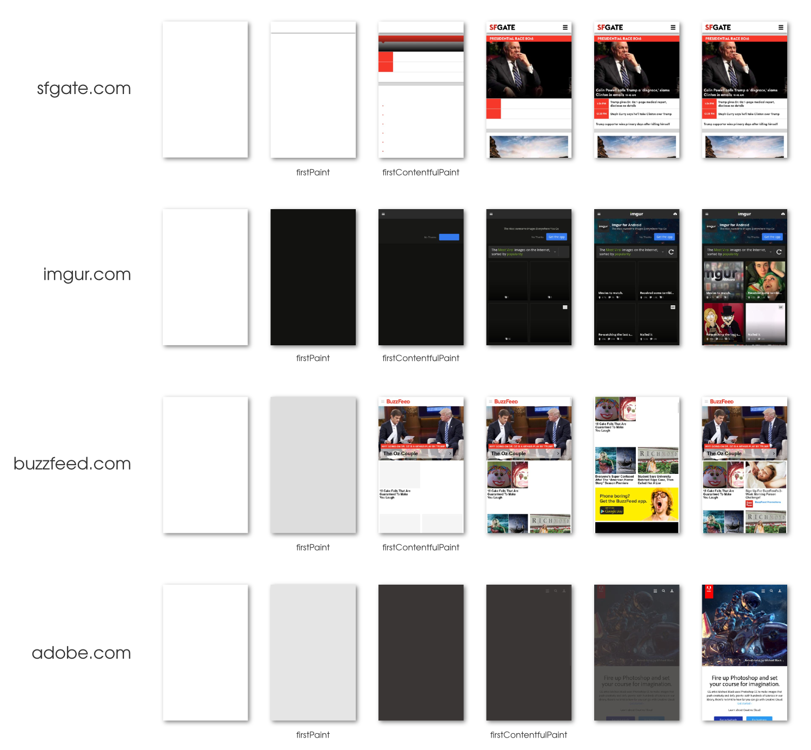

# PerformancePaintTiming

Web developers require more information on page load performance in the wild. 
No single moment in time completely captures the "loading experience". To give developers insight into the loading experience, we propose a set of key progress metrics to capture the series of key moments during pageload which developers care about.

For detailed motivation, see the [Why First Paint?](https://docs.google.com/document/d/1wdxSXo_jctZjdPaJeTtYYFF-rLtUFxrU72_7h9qbQaM/edit) doc.

First Paint (FP), is the first of these key moments, followed by First Contentful Paint (FCP). In the future, we may add additional metrics, such as First Meaningful Paint (FMP), and Time to Interactive (TTI).

## Interface
We propose introducing the `PerformancePaintTiming` interface, extending the PerformanceEntry interface, to report the time to first paint and time to first contentful paint.

```javascript
interface PerformancePaintTiming : PerformanceEntry {};
```

Entries will have a `name` of "first-paint" and "first-contentful-paint" respectively, and an `entryType` of `"paint"`. `startTime` is the `DOMHighResTimeStamp` indicating when the paint occurred, and the `duration` will always be 0.

## Definition

- `"first-paint"` entries contain a `DOMHighResTimeStamp` reporting the time when the browser first rendered after navigation. This excludes the default background paint, but includes non-default background paint. This is the first key moment developers care about in page load – when the browser has started to render the page.

- `"first-contentful-paint"` contain a `DOMHighResTimestamp` reporting the time when the browser first rendered any text, image (including background images), non-white canvas or SVG. This includes text with pending webfonts. This is the first time users could start consuming page content.

_WIP: [define processing algorithm and integration with HTML](https://github.com/w3c/paint-timing/issues/4)_

---

The browser has performed a "paint" or "render" when it has converted the render tree to pixels on the screen. 

More formally, we consider the browser to have "rendered" a document when it has updated "the rendering or user interface of that Document and its browsing context to reflect the current state". See the HTML spec's section on the event loop processing model – [section 7.12](https://html.spec.whatwg.org/multipage/webappapis.html#event-loop-processing-model).

The rendering pipeline is very complex, and the timestamp should be the latest timestamp the browser is able to note in this pipeline (best effort). Typically the time at which the frame is submitted to the OS for display is recommended for this API.


## Usage

```javascript

const observer = new PerformanceObserver(function(list) {
  const perfEntries = list.getEntries();
  for (const perfEntry of perfEntries) {
     // Process entries
     // report back for analytics and monitoring
     // ...
  }
});

// register observer for paint timing notifications
observer.observe({entryTypes: ["paint"]});

```
These entries will be buffered for the cases where PerformanceObserver is unable to register itself early enough on the page. 
For this case paint entries can be accessed as follows:
```javascript

performance.getEntriesByType('paint');
```

## Examples

These examples are hand annotated, based on the definitions given above.



Some rough bulk data can be seen [here](https://docs.google.com/spreadsheets/d/1i0-tOtZP21m3DjBJflUJYao9-WAKwWV2p9WFlVhVivg/edit#gid=1447332636) or [here](https://docs.google.com/spreadsheets/d/1nGauGA3EvN8NBC3ErWjLd8Bz-NzmmEa6q6UP5KhfgeA/edit#gid=0). This data was collected using a somewhat different definition than we're currently using – it includes white paints in `first-paint` and only looks at text and image paints for `first-contentful-paint`.

#### Why not add this to Navigation Timing?
This belongs outside Navigation Timing because Navigation Timing is spec'd as queueing the entry on document load end; however, FCP (or FMP in the future) may not have triggered at that point.
